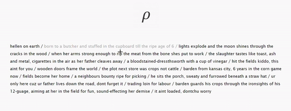
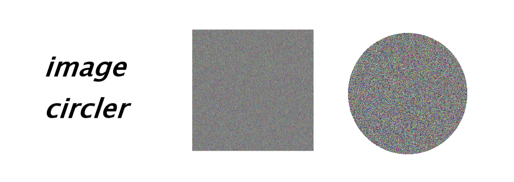

# <i>experiments</i>

<b>a collection of new concepts and ideas, 
the early buds of greater things</b>

<h3><i><a href="https://github.com/gregoryclayton/experiments/tree/main/matplotlib-visualizer">Matplotlib-Visualizer</a></i></h3>

<h3><i>Worlds-Densest-Novel</i></h3>

<h3><i>image-Circler</i></h3>

<h3><i>Stucco</i></h3>

